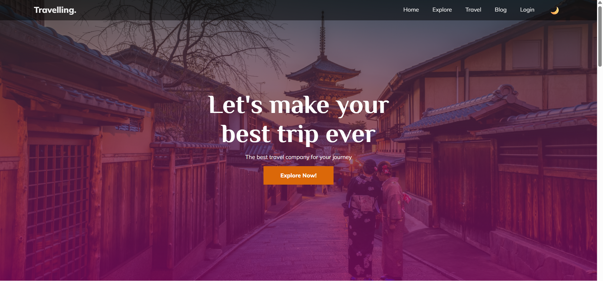
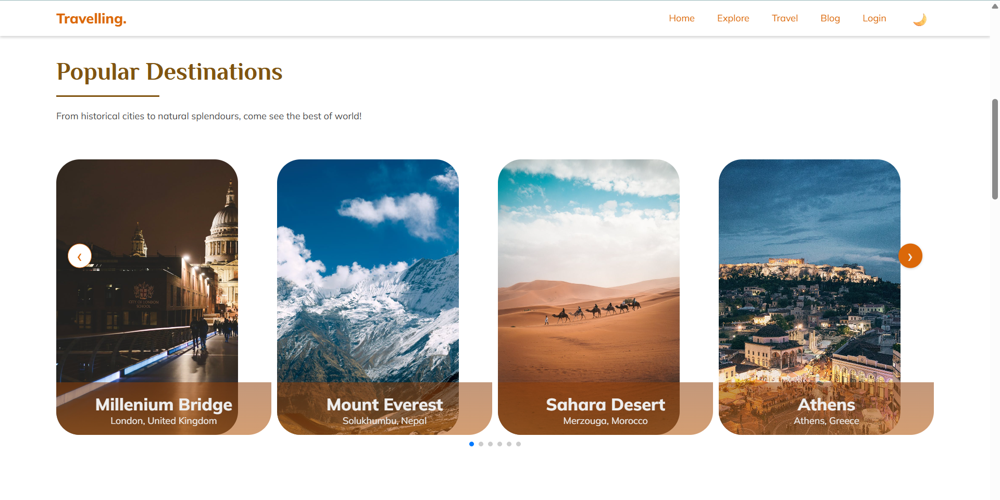
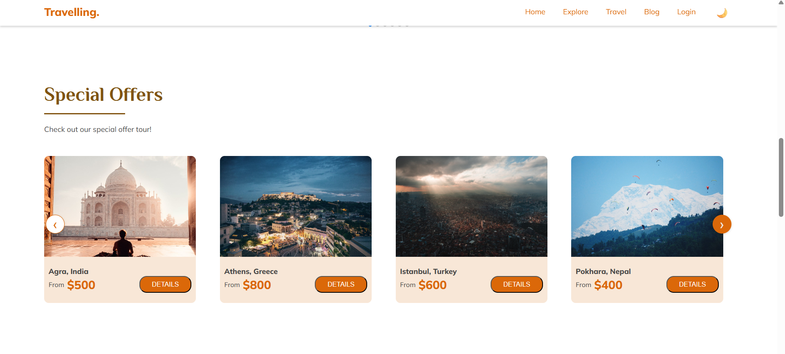
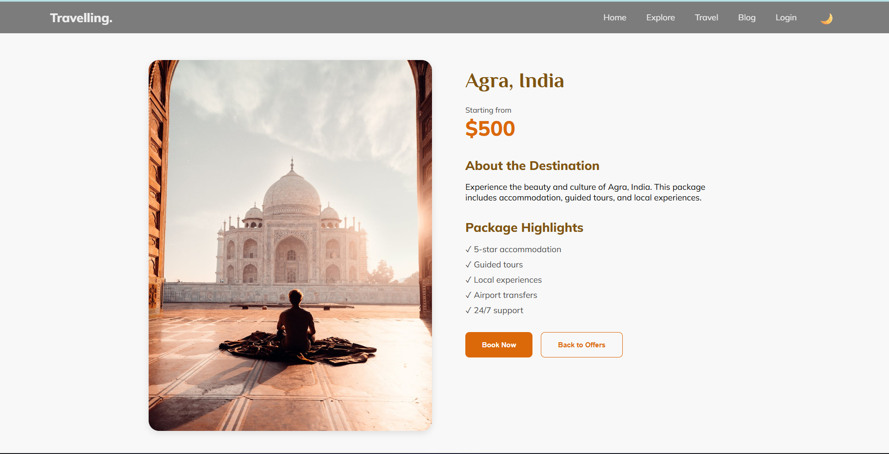
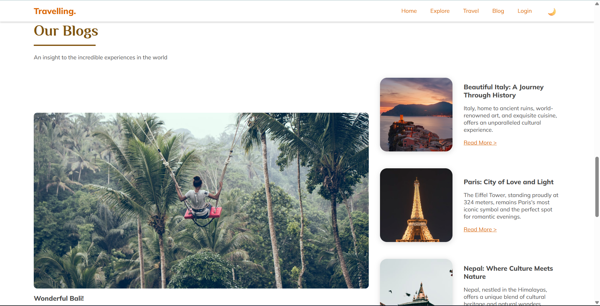
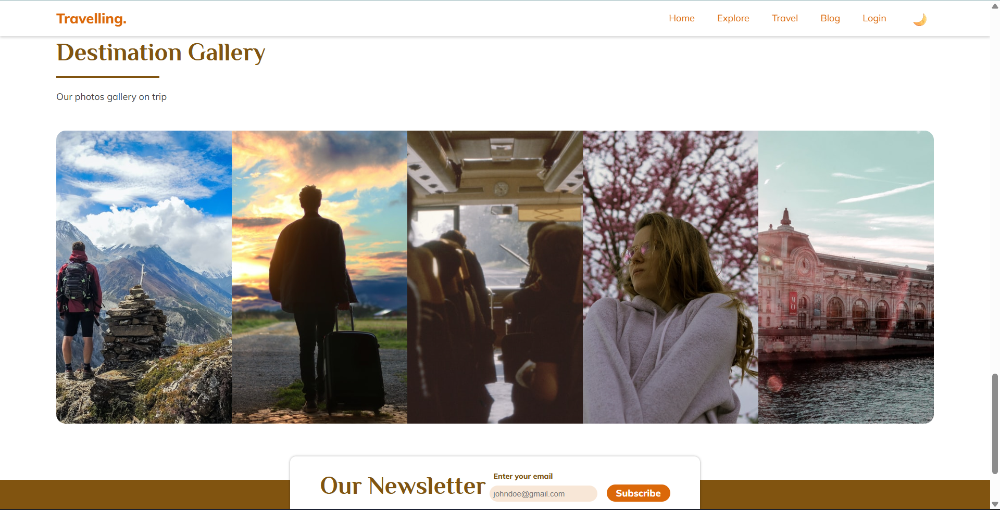
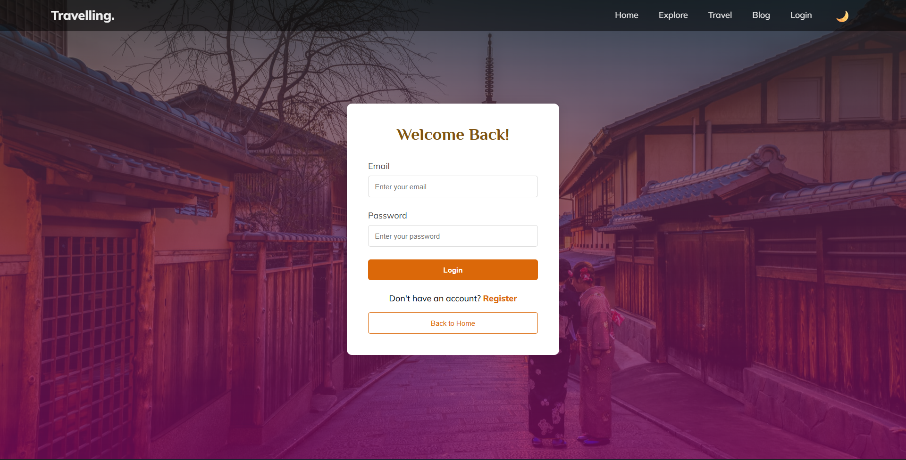

# Travel Website

A modern travel website built with React.js.

## Features
- Responsive Design
- Dark/Light Theme
- Interactive Components
- Authentication System
- Image Sliders
- Special Offers
- Blog Section
- Gallery

## Technologies Used
- React.js
- React Router
- Context API
- CSS3

## Screenshots
### Home Page


### Popular Destination


### Special Offers


### Offer Card


### Blogs


### Gallery


### Login Form


## Installation and Setup
```bash
# Clone the repository
git clone https://github.com/Kalpit-Pandey/travelling.git

# Install dependencies
npm install

# Run development server
npm run dev
